# README-assets

GitHub 프로필/프로젝트 README에서 쓰는 커스텀 애니메이션 SVG 모음.
외부 서비스(capsule-render 등) 없이 직접 만든 에셋입니다.

## header/terminal.svg

macOS 터미널 창 스타일 헤더. 명령이 타이핑되듯 순서대로 실행되며
이름 → 직무 → 기술스택 칩이 출력되고, 마지막 프롬프트에서 커서가 깜빡입니다.



### 사용법

```markdown

```

### 구현 포인트

- **타이핑 효과**: 명령 줄을 `clipPath`로 가리고, rect의 `width`를
  `calcMode="discrete"`(계단식 보간)로 늘려서 글자가 한 글자씩 찍히는 느낌을 냄
- **연출 순서**: 모든 애니메이션의 `begin`을 타임라인처럼 배치
  (0.5s 명령 타이핑 → 1.5s 출력 → 2.4s 다음 명령 → 3.5s부터 스택 칩이 0.2s 간격 등장 → 4.8s 커서)
- **한 번 실행 후 유지**: `fill="freeze"`로 마지막 상태 고정, 커서만 `repeatCount="indefinite"`로 무한 깜빡임
- **색상**: GitHub 다크 테마 공식 팔레트(`#0d1117`, `#161b22`, `#7ee787`, `#79c0ff` 등)를
  그대로 써서 프로필에 얹었을 때 이질감이 없도록 함
- **폰트**: GitHub 이미지 프록시(camo)는 외부 폰트 로드를 차단하므로 시스템 모노스페이스 폰트 스택만 사용

라이트 테마 버전: [header/terminal-light.svg](header/terminal-light.svg) — 다크/라이트 자동 전환 방법은 [아래](#다크라이트-테마-자동-전환) 참고.

## stack/stack-card.svg

기술스택 전용 카드. shields.io 뱃지 나열 대신 카테고리별 행으로 정리하고,
타이틀 밑줄이 그어진 뒤 행이 위에서부터 순서대로 페이드인됩니다.



### 사용법

```markdown

```

### 구현 포인트

- **난잡함 방지 규칙**: 브랜드 컬러는 칩의 테두리·점에만 쓰고 텍스트는 흰색(`#e6edf3`)으로 통일,
  모든 칩은 같은 높이(28px)·같은 둥글기(rx 14)·같은 시작 기준선(x=170)에 정렬
- **카테고리 구분**: 왼쪽 라벨 열(FRONTEND / BACKEND / DATABASE / INFRA·TOOLS)과 세로 구분선으로 틀을 잡음
- **어두운 브랜드 컬러 보정**: MySQL·PostgreSQL처럼 어두운 색은 점(dot)만 밝은 톤으로 바꿔 가독성 확보
- **등장 연출**: 행 단위 `opacity` 페이드인을 0.3s 간격으로 스태거

## stack/stack-card-logos.svg

스택 카드의 로고 버전 — 색점 대신 칩 안에 simple-icons 브랜드 로고가 들어갑니다.
`scripts/generate_stack_card.py`로 생성하며, 칩 폭은 글자 길이에 맞춰 자동 계산됩니다.



```markdown

```

라이트 테마 버전: [stack/stack-card-light.svg](stack/stack-card-light.svg)

## badges/ — 개별 기술 뱃지 (89종 × 2스타일)

기술마다 SVG 파일 하나씩. **전체 목록과 마크다운 복사는 [badges/README.md](badges/README.md)에서.**
로고는 [simple-icons](https://simpleicons.org)(CC0)의 정식 브랜드 로고 패스를 사용했습니다.

**`clean/`** — 흰 배경 + 회색 테두리 통일, 브랜드 컬러는 로고에만. 문서·이력서 톤.


**`dark/`** — GitHub 다크 팔레트 + 브랜드 컬러 테두리·틴트. 터미널 헤더·스택 카드와 같은 세트.


새 뱃지 추가: 로고 다운로드 → `scripts/generate_badges.py`의 `CATEGORIES`에 한 줄 추가 → 실행.
뱃지 178개와 갤러리 문서(`badges/README.md`)가 전부 스크립트로 재생성됩니다 — 자세한 방법은 [badges/README.md](badges/README.md) 참고.

> WebSocket·OAuth는 프로토콜이라 simple-icons에 공식 브랜드 로고가 없어 제외했습니다.
> 실시간 통신 자리는 Socket.io로, 인증은 JWT로 대체했습니다.

## projects/ — 프로젝트 소개 카드 + 상세 정보

레포 README의 프로젝트 섹션용. 카드(SVG)는 제목·기간·역할·스택까지만 요약하고,
ERD·아키텍처·트러블슈팅처럼 긴 내용은 GitHub 네이티브 `<details>` 접기 블록으로 펼칩니다
(SVG는 ``로 삽입되는 순간 클릭 인터랙션이 죽어서, 진짜 "펼쳐지는 카드"는
이미지+`<details>` 조합으로 만드는 게 정석입니다).



사용법·markdown 템플릿·트러블슈팅 작성 포맷은 **[projects/README.md](projects/README.md)** 에 정리했습니다.

## stats/ — GitHub 통계 카드 (자체 제작)

github-readme-stats를 안 쓰고, GitHub REST API를 직접 호출해 Public Repos·Followers·
Total Stars·언어 비중을 SVG로 굽는 스크립트입니다.


```bash
python3 scripts/generate_stats_card.py <github-username>
```

이 카드는 **실행 시점의 정적 스냅샷**입니다 — 실시간 자동 갱신에는 서버 배포가 필요하며,
그 차이와 다음 단계는 **[stats/README.md](stats/README.md)** 에서 설명합니다.

## 다크/라이트 테마 자동 전환

헤더·스택 카드는 다크/라이트 두 버전이 있습니다. GitHub README는 `<picture>` +
`prefers-color-scheme`을 지원해서, 보는 사람의 GitHub 테마 설정에 따라 자동으로
바뀌는 이미지를 만들 수 있습니다:

```markdown
<picture>
  <source media="(prefers-color-scheme: dark)" srcset="https://raw.githubusercontent.com/Mungwani/README-assets/main/header/terminal.svg">
  <source media="(prefers-color-scheme: light)" srcset="https://raw.githubusercontent.com/Mungwani/README-assets/main/header/terminal-light.svg">
  
</picture>
```

`img`의 `src`는 `<picture>`를 지원하지 않는 뷰어(일부 markdown 렌더러)를 위한 폴백입니다.
