# GitHub Stats Card (자체 제작)

github-readme-stats 같은 서비스를 안 쓰고, GitHub REST API를 직접 호출해
Public Repos · Followers · Total Stars · 언어 비중을 SVG 카드로 굽는 스크립트입니다.



## 사용법

```bash
python3 scripts/generate_stats_card.py <github-username>
```

```markdown

```

## 정적 스냅샷 vs 실시간 카드 — 알아야 할 차이

이 카드는 **실행한 시점의 스냅샷**을 정적 SVG 파일로 저장합니다.
github-readme-stats처럼 "프로필을 볼 때마다" 최신 값으로 바뀌게 하려면,
요청이 올 때마다 GitHub API를 호출해서 SVG를 즉석에서 그려주는 **서버**가
필요합니다 (Vercel 서버리스 함수 등으로 배포). 이 레포는 정적 파일 저장소라
서버를 두지 않았고, 대신 스크립트를 재실행 → 커밋하는 방식으로 갱신합니다.

실시간 버전으로 발전시키고 싶다면: 이 스크립트의 로직을 그대로 API
엔드포인트(예: `/api/stats?user=Mungwani`)로 옮기고, 응답에
`Content-Type: image/svg+xml`과 `Cache-Control` 헤더를 붙여 배포하면 됩니다.
이 자체가 "파라미터 파싱 → 외부 API 호출 → 캐싱 → SVG 응답"으로 이어지는
백엔드 프로젝트 하나가 될 만큼 분량이 있어서, 별도로 진행하는 걸 추천합니다.

## 구현 포인트

- **데이터 소스**: `/users/{username}`(팔로워·레포 수)와 `/users/{username}/repos`
  (스타 합산·언어 카운트)를 인증 없이 호출 — 비인증 요청은 시간당 60회 제한이라
  개인 정적 스냅샷 용도로는 충분
- **언어 비중 계산**: 레포별 `language` 필드(GitHub이 판단한 대표 언어) 개수를 세는 방식.
  실제 github-readme-stats는 바이트 수 기준이라 더 정교하지만, 여기서는
  API 호출 한 번으로 끝내는 것을 우선함 — 언어 판별 정밀도보다 "직접 만든 파이프라인"
  자체가 핵심이므로 트레이드오프로 명시
- **디자인**: 다른 카드들과 같은 `#0d1117` 다크 톤 + 그라데이션 테두리로 세트 유지
